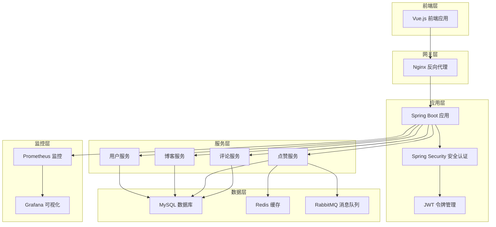
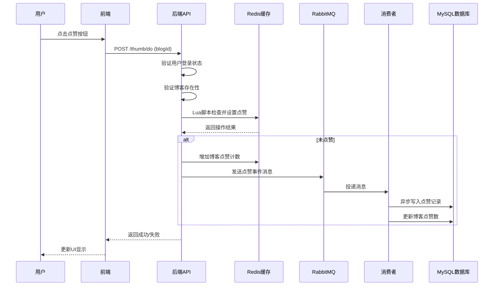

# 软件需求规格说明书（SRS）

**项目名称**：博客点赞系统  
**文档版本**：V1.0  
**编写日期**：2026年5月16日  
**编写标准**：IEEE 830 / GB/T 8567-2006  

---

## 1. 引言

### 1.1 文档目的

本文档旨在详细描述博客点赞系统的软件需求，为系统设计、开发、测试和验收提供明确的依据。本文档适用于以下人员：

- **系统分析师**：用于理解系统需求和约束条件
- **软件设计师**：用于进行系统架构设计和详细设计
- **开发人员**：用于编码实现和单元测试
- **测试人员**：用于编写测试用例和执行系统测试
- **项目经理**：用于项目进度控制和质量管理
- **用户代表**：用于需求确认和验收评审

### 1.2 范围

本项目是一个基于 Web 的博客点赞系统，主要功能包括：

- **用户管理**：用户注册、登录、登出
- **博客管理**：博客的创建、查询、更新、删除、分页展示
- **点赞功能**：用户对博客进行点赞和取消点赞操作，支持高并发场景
- **评论功能**：用户对博客发表评论、查询评论、删除评论、分页展示

系统采用前后端分离架构，后端使用 Java + SpringBoot，前端使用 Vue.js，数据库使用 MySQL，缓存使用 Redis，消息队列使用 RabbitMQ。

### 1.3 术语定义

| 术语 | 定义 |
|------|------|
| SRS | Software Requirements Specification，软件需求规格说明书 |
| JWT | JSON Web Token，用于身份验证的令牌 |
| Redis | 开源内存数据库，用于缓存和会话管理 |
| RabbitMQ | 开源消息队列，用于异步处理 |
| MyBatis-Plus | MyBatis 的增强工具，简化数据库操作 |
| Spring Security | Spring 框架的安全模块 |
| CORS | Cross-Origin Resource Sharing，跨域资源共享 |
| API | Application Programming Interface，应用程序编程接口 |
| VO | Value Object，值对象 |
| DTO | Data Transfer Object，数据传输对象 |

### 1.4 参考资料

1. IEEE Std 830-1998, IEEE Recommended Practice for Software Requirements Specifications
2. GB/T 8567-2006, 计算机软件文档编制规范
3. Spring Boot 3.1.12 官方文档
4. MyBatis-Plus 3.5.10.1 官方文档
5. Redis 7.0 官方文档
6. RabbitMQ 3.12 官方文档
7. JWT (JSON Web Token) RFC 7519

---

## 2. 总体描述

### 2.1 产品视角

博客点赞系统是一个面向互联网用户的博客平台，支持用户发布博客、浏览博客、点赞博客和发表评论。系统采用前后端分离架构，后端提供 RESTful API 接口，前端通过 HTTP 协议与后端交互。

系统架构图如下：



### 2.2 用户特征

系统主要面向以下用户角色：

| 用户角色 | 角色描述 | 主要权限 |
|----------|----------|----------|
| **普通用户** | 注册并登录系统的用户 | 浏览博客、点赞/取消点赞、发表评论、查看个人博客、创建/编辑/删除个人博客 |
| **游客** | 未登录的访客 | 浏览公开博客、查看点赞数、查看评论 |

### 2.3 运行环境

#### 2.3.1 硬件环境

| 组件 | 最低配置 | 推荐配置 |
|------|----------|----------|
| 服务器 CPU | 4 核 | 8 核及以上 |
| 服务器内存 | 8GB | 16GB 及以上 |
| 服务器磁盘 | 100GB SSD | 200GB SSD 及以上 |
| 网络 | 100Mbps | 1Gbps |

#### 2.3.2 软件环境

| 组件 | 版本要求 |
|------|----------|
| 操作系统 | Linux (CentOS 7+/Ubuntu 18.04+) 或 Windows Server 2016+ |
| JDK | JDK 17 |
| MySQL | MySQL 8.0+ |
| Redis | Redis 7.0+ |
| RabbitMQ | RabbitMQ 3.12+ |
| Nginx | Nginx 1.20+ |
| 浏览器 | Chrome 90+/Firefox 88+/Edge 90+/Safari 14+ |

#### 2.3.3 开发环境

| 组件 | 版本要求 |
|------|----------|
| IDE | IntelliJ IDEA 2023+ / Eclipse 2023+ |
| Maven | Maven 3.8+ |
| Node.js | Node.js 18+ |
| Git | Git 2.30+ |

### 2.4 设计约束

#### 2.4.1 技术约束

- 后端框架必须使用 Spring Boot 3.1.12
- 持久层框架必须使用 MyBatis-Plus 3.5.10.1
- 数据库必须使用 MySQL 8.0+
- 缓存必须使用 Redis 7.0+
- 消息队列必须使用 RabbitMQ 3.12+
- 前端框架必须使用 Vue.js 3.x
- 身份认证必须使用 JWT + Spring Security

#### 2.4.2 安全约束

- 用户密码必须使用 BCrypt 加密存储
- 所有 API 接口（除登录注册外）必须进行 JWT 身份验证
- 敏感数据传输必须使用 HTTPS 协议
- 数据库连接必须使用连接池
- 必须防止 SQL 注入、XSS 攻击、CSRF 攻击

#### 2.4.3 性能约束

- 系统必须支持至少 1000 QPS 的并发请求
- 点赞操作响应时间必须小于 100ms
- 博客列表查询响应时间必须小于 200ms
- 系统可用性必须达到 99.9%

#### 2.4.4 合规约束

- 系统必须符合《网络安全法》相关规定
- 用户数据必须进行隐私保护
- 必须支持数据导出和删除功能（GDPR 合规）

### 2.5 假设与依赖

#### 2.5.1 假设

- 用户具备基本的计算机操作能力
- 用户能够访问互联网
- 系统部署环境具备稳定的网络连接
- 数据库服务器具备足够的存储空间
- Redis 和 RabbitMQ 服务正常运行

#### 2.5.2 依赖

- 依赖 MySQL 数据库服务正常运行
- 依赖 Redis 缓存服务正常运行
- 依赖 RabbitMQ 消息队列服务正常运行
- 依赖 Nginx 反向代理服务正常运行
- 依赖 Prometheus + Grafana 监控服务正常运行

---

## 3. 具体功能需求

### 3.1 用户管理模块

#### 3.1.1 用户注册

| 项目 | 内容 |
|------|------|
| **功能编号** | FR-USER-001 |
| **功能名称** | 用户注册 |
| **输入** | 用户名（3-20 字符，字母数字下划线）、密码（6-20 字符）、邮箱（有效邮箱格式）、全名（可选，1-50 字符） |
| **处理逻辑** | 1. 验证输入参数格式<br>2. 检查用户名是否已存在<br>3. 检查邮箱是否已存在<br>4. 使用 BCrypt 加密密码<br>5. 创建用户记录到数据库<br>6. 设置用户状态为启用 |
| **输出** | 注册成功提示或错误信息（用户名已存在、邮箱已存在、参数格式错误） |
| **验收标准** | 1. 用户名重复时返回明确错误提示<br>2. 邮箱重复时返回明确错误提示<br>3. 密码必须加密存储<br>4. 注册成功后用户可直接登录 |

#### 3.1.2 用户登录

| 项目 | 内容 |
|------|------|
| **功能编号** | FR-USER-002 |
| **功能名称** | 用户登录 |
| **输入** | 用户名、密码 |
| **处理逻辑** | 1. 验证输入参数非空<br>2. 使用 Spring Security 进行身份认证<br>3. 认证成功后生成 JWT Token<br>4. 返回 Token 和用户信息 |
| **输出** | JWT Token、用户信息（用户名、邮箱、全名）或错误信息（用户名或密码错误） |
| **验收标准** | 1. 用户名或密码错误时返回 401 状态码<br>2. 登录成功返回有效 JWT Token<br>3. Token 有效期为 7 天<br>4. 密码错误 5 次后锁定账户 30 分钟 |

#### 3.1.3 用户登出

| 项目 | 内容 |
|------|------|
| **功能编号** | FR-USER-003 |
| **功能名称** | 用户登出 |
| **输入** | JWT Token（从请求头获取） |
| **处理逻辑** | 1. 从请求头获取 JWT Token<br>2. 将 Token 加入 Redis 黑名单<br>3. 清除用户会话信息 |
| **输出** | 登出成功提示 |
| **验收标准** | 1. 登出后 Token 立即失效<br>2. 黑名单 Token 无法再次使用<br>3. 返回明确的登出成功提示 |

### 3.2 博客管理模块

#### 3.2.1 创建博客

| 项目 | 内容 |
|------|------|
| **功能编号** | FR-BLOG-001 |
| **功能名称** | 创建博客 |
| **输入** | 标题（1-100 字符）、封面图片 URL（可选）、内容（1-10000 字符） |
| **处理逻辑** | 1. 验证用户已登录<br>2. 验证输入参数格式<br>3. 创建博客记录并关联当前用户<br>4. 初始化点赞数为 0<br>5. 设置创建时间和更新时间 |
| **输出** | 创建成功的博客信息（包含博客 ID）或错误信息（未登录、参数错误） |
| **验收标准** | 1. 必须登录才能创建博客<br>2. 标题和内容不能为空<br>3. 创建成功后博客 ID 自动生成<br>4. 初始点赞数为 0 |

#### 3.2.2 查询博客列表

| 项目 | 内容 |
|------|------|
| **功能编号** | FR-BLOG-002 |
| **功能名称** | 查询博客列表 |
| **输入** | 页码（默认 1）、每页数量（默认 10，最大 50） |
| **处理逻辑** | 1. 验证分页参数合法性<br>2. 查询数据库获取博客列表<br>3. 查询当前用户对每个博客的点赞状态<br>4. 返回分页结果 |
| **输出** | 博客列表（包含博客 ID、标题、封面、内容、点赞数、创建时间、当前用户是否点赞） |
| **验收标准** | 1. 支持分页查询<br>2. 每页最大数量不超过 50<br>3. 返回当前用户的点赞状态<br>4. 按创建时间倒序排列 |

#### 3.2.3 查询我的博客

| 项目 | 内容 |
|------|------|
| **功能编号** | FR-BLOG-003 |
| **功能名称** | 查询我的博客 |
| **输入** | 无 |
| **处理逻辑** | 1. 验证用户已登录<br>2. 获取当前用户 ID<br>3. 查询该用户创建的所有博客 |
| **输出** | 当前用户创建的博客列表 |
| **验收标准** | 1. 必须登录才能查询<br>2. 只返回当前用户创建的博客<br>3. 按创建时间倒序排列 |

#### 3.2.4 查询单个博客

| 项目 | 内容 |
|------|------|
| **功能编号** | FR-BLOG-004 |
| **功能名称** | 查询单个博客 |
| **输入** | 博客 ID |
| **处理逻辑** | 1. 验证博客 ID 格式<br>2. 查询数据库获取博客信息<br>3. 查询当前用户对该博客的点赞状态 |
| **输出** | 博客详细信息或错误信息（博客不存在） |
| **验收标准** | 1. 博客不存在时返回 404 状态码<br>2. 返回当前用户的点赞状态<br>3. 包含完整的博客信息 |

#### 3.2.5 更新博客

| 项目 | 内容 |
|------|------|
| **功能编号** | FR-BLOG-005 |
| **功能名称** | 更新博客 |
| **输入** | 博客 ID、标题、封面图片 URL（可选）、内容 |
| **处理逻辑** | 1. 验证用户已登录<br>2. 验证用户是博客作者<br>3. 验证输入参数格式<br>4. 更新博客信息<br>5. 更新修改时间 |
| **输出** | 更新后的博客信息或错误信息（无权限、博客不存在） |
| **验收标准** | 1. 只有博客作者可以更新<br>2. 无权限时返回 403 状态码<br>3. 博客不存在时返回 404 状态码<br>4. 更新时间自动更新 |

#### 3.2.6 删除博客

| 项目 | 内容 |
|------|------|
| **功能编号** | FR-BLOG-006 |
| **功能名称** | 删除博客 |
| **输入** | 博客 ID |
| **处理逻辑** | 1. 验证用户已登录<br>2. 验证用户是博客作者<br>3. 删除博客记录<br>4. 级联删除相关点赞记录<br>5. 级联删除相关评论记录 |
| **输出** | 删除成功提示或错误信息（无权限、博客不存在） |
| **验收标准** | 1. 只有博客作者可以删除<br>2. 无权限时返回 403 状态码<br>3. 删除成功后相关点赞和评论一并删除 |

#### 3.2.7 分页查询博客

| 项目 | 内容 |
|------|------|
| **功能编号** | FR-BLOG-007 |
| **功能名称** | 分页查询博客 |
| **输入** | 页码（默认 1）、每页数量（默认 10，最大 50） |
| **处理逻辑** | 1. 验证分页参数合法性<br>2. 查询数据库获取博客分页数据<br>3. 查询当前用户对每个博客的点赞状态<br>4. 返回分页结果（包含总记录数、总页数） |
| **输出** | 分页结果（记录列表、总记录数、当前页码、每页数量、总页数） |
| **验收标准** | 1. 支持分页查询<br>2. 返回完整的分页信息<br>3. 每页最大数量不超过 50<br>4. 按创建时间倒序排列 |

#### 3.2.8 分页查询我的博客

| 项目 | 内容 |
|------|------|
| **功能编号** | FR-BLOG-008 |
| **功能名称** | 分页查询我的博客 |
| **输入** | 页码（默认 1）、每页数量（默认 10，最大 50） |
| **处理逻辑** | 1. 验证用户已登录<br>2. 获取当前用户 ID<br>3. 查询该用户创建的博客分页数据<br>4. 返回分页结果 |
| **输出** | 分页结果（记录列表、总记录数、当前页码、每页数量、总页数） |
| **验收标准** | 1. 必须登录才能查询<br>2. 只返回当前用户创建的博客<br>3. 返回完整的分页信息 |

### 3.3 点赞模块

#### 3.3.1 点赞博客

| 项目 | 内容 |
|------|------|
| **功能编号** | FR-THUMB-001 |
| **功能名称** | 点赞博客 |
| **输入** | 博客 ID |
| **处理逻辑** | 1. 验证用户已登录<br>2. 验证博客是否存在<br>3. 检查用户是否已点赞（Redis Lua 脚本原子操作）<br>4. 如果未点赞，则执行点赞操作<br>5. 使用 Redis SET 存储点赞关系<br>6. 使用 Redis Counter 增加博客点赞数<br>7. 发送点赞事件到 RabbitMQ<br>8. 异步同步到 MySQL 数据库<br>9. 记录成功/失败指标到 Prometheus |
| **输出** | 点赞成功（true）或失败（false） |
| **验收标准** | 1. 必须登录才能点赞<br>2. 同一用户对同一博客只能点赞一次<br>3. 点赞数实时更新<br>4. 支持高并发场景（1000 QPS）<br>5. 响应时间小于 100ms<br>6. 点赞数据最终一致性（异步同步到 DB） |

点赞流程图：



#### 3.3.2 取消点赞

| 项目 | 内容 |
|------|------|
| **功能编号** | FR-THUMB-002 |
| **功能名称** | 取消点赞 |
| **输入** | 博客 ID |
| **处理逻辑** | 1. 验证用户已登录<br>2. 验证博客是否存在<br>3. 检查用户是否已点赞<br>4. 如果已点赞，则取消点赞<br>5. 从 Redis SET 移除点赞关系<br>6. 使用 Redis Counter 减少博客点赞数<br>7. 发送取消点赞事件到 RabbitMQ<br>8. 异步同步到 MySQL 数据库 |
| **输出** | 取消成功（true）或失败（false） |
| **验收标准** | 1. 必须登录才能取消点赞<br>2. 只能取消自己点赞的博客<br>3. 点赞数实时更新<br>4. 支持高并发场景<br>5. 响应时间小于 100ms |

#### 3.3.3 点赞数据同步

| 项目 | 内容 |
|------|------|
| **功能编号** | FR-THUMB-003 |
| **功能名称** | 点赞数据同步 |
| **输入** | 定时任务触发 |
| **处理逻辑** | 1. 定时从 Redis 读取点赞数据<br>2. 批量同步到 MySQL 数据库<br>3. 处理同步失败的数据<br>4. 记录同步日志 |
| **输出** | 同步结果统计 |
| **验收标准** | 1. 每分钟执行一次同步<br>2. 支持补偿机制处理失败数据<br>3. 保证数据最终一致性 |

#### 3.3.4 点赞数据对账

| 项目 | 内容 |
|------|------|
| **功能编号** | FR-THUMB-004 |
| **功能名称** | 点赞数据对账 |
| **输入** | 定时任务触发（每天凌晨执行） |
| **处理逻辑** | 1. 对比 Redis 和 MySQL 中的点赞数据<br>2. 发现不一致数据<br>3. 以 Redis 数据为准进行修正<br>4. 记录对账报告 |
| **输出** | 对账报告 |
| **验收标准** | 1. 每天凌晨执行一次<br>2. 发现不一致自动修正<br>3. 生成对账报告供审计 |

### 3.4 评论模块

#### 3.4.1 发表评论

| 项目 | 内容 |
|------|------|
| **功能编号** | FR-COMMENT-001 |
| **功能名称** | 发表评论 |
| **输入** | 博客 ID、评论内容（1-500 字符）、父评论 ID（可选，用于回复评论） |
| **处理逻辑** | 1. 验证用户已登录<br>2. 验证博客是否存在<br>3. 验证评论内容非空<br>4. 如果有父评论 ID，验证父评论存在<br>5. 创建评论记录<br>6. 设置创建时间 |
| **输出** | 创建成功的评论信息或错误信息（博客不存在、参数错误） |
| **验收标准** | 1. 必须登录才能发表评论<br>2. 评论内容不能为空<br>3. 支持回复评论（二级评论）<br>4. 创建成功后返回评论 ID |

#### 3.4.2 查询博客评论

| 项目 | 内容 |
|------|------|
| **功能编号** | FR-COMMENT-002 |
| **功能名称** | 查询博客评论 |
| **输入** | 博客 ID |
| **处理逻辑** | 1. 验证博客 ID 格式<br>2. 查询该博客的所有评论<br>3. 查询评论者的用户信息<br>4. 按创建时间倒序排列 |
| **输出** | 评论列表（包含评论 ID、内容、创建时间、评论者信息） |
| **验收标准** | 1. 只返回指定博客的评论<br>2. 包含评论者用户名和全名<br>3. 按创建时间倒序排列<br>4. 不返回已删除的评论 |

#### 3.4.3 分页查询博客评论

| 项目 | 内容 |
|------|------|
| **功能编号** | FR-COMMENT-003 |
| **功能名称** | 分页查询博客评论 |
| **输入** | 博客 ID、页码（默认 1）、每页数量（默认 10，最大 50） |
| **处理逻辑** | 1. 验证博客 ID 格式<br>2. 验证分页参数合法性<br>3. 查询该博客的评论分页数据<br>4. 查询评论者的用户信息<br>5. 返回分页结果 |
| **输出** | 分页结果（记录列表、总记录数、当前页码、每页数量、总页数） |
| **验收标准** | 1. 支持分页查询<br>2. 返回完整的分页信息<br>3. 每页最大数量不超过 50 |

#### 3.4.4 删除评论

| 项目 | 内容 |
|------|------|
| **功能编号** | FR-COMMENT-004 |
| **功能名称** | 删除评论 |
| **输入** | 评论 ID |
| **处理逻辑** | 1. 验证用户已登录<br>2. 验证评论存在<br>3. 验证用户是评论作者<br>4. 逻辑删除评论（设置 is_deleted=1） |
| **输出** | 删除成功提示或错误信息（无权限、评论不存在） |
| **验收标准** | 1. 只有评论作者可以删除<br>2. 无权限时返回 403 状态码<br>3. 使用逻辑删除，不物理删除 |

#### 3.4.5 统计评论数

| 项目 | 内容 |
|------|------|
| **功能编号** | FR-COMMENT-005 |
| **功能名称** | 统计评论数 |
| **输入** | 博客 ID |
| **处理逻辑** | 1. 验证博客 ID 格式<br>2. 统计该博客的有效评论数（未删除的评论） |
| **输出** | 评论总数 |
| **验收标准** | 1. 只统计未删除的评论<br>2. 返回准确的评论数量 |

### 3.5 系统用例图

```mermaid
useCaseDiagram
    actor "普通用户" as User
    actor "游客" as Guest
    
    package "博客点赞系统" {
        usecase "用户注册" as UC1
        usecase "用户登录" as UC2
        usecase "用户登出" as UC3
        usecase "创建博客" as UC4
        usecase "查询博客列表" as UC5
        usecase "查询我的博客" as UC6
        usecase "查询单个博客" as UC7
        usecase "更新博客" as UC8
        usecase "删除博客" as UC9
        usecase "点赞博客" as UC10
        usecase "取消点赞" as UC11
        usecase "发表评论" as UC12
        usecase "查询评论" as UC13
        usecase "删除评论" as UC14
    }
    
    User --> UC1
    User --> UC2
    User --> UC3
    User --> UC4
    User --> UC5
    User --> UC6
    User --> UC7
    User --> UC8
    User --> UC9
    User --> UC10
    User --> UC11
    User --> UC12
    User --> UC13
    User --> UC14
    
    Guest --> UC5
    Guest --> UC7
    Guest --> UC13
```

---

## 4. 非功能需求

### 4.1 性能需求

| 需求项 | 具体指标 |
|--------|----------|
| **响应时间** | 点赞操作响应时间 < 100ms（P95）<br>博客列表查询响应时间 < 200ms（P95）<br>单个博客查询响应时间 < 100ms（P95）<br>评论查询响应时间 < 200ms（P95） |
| **吞吐量** | 系统支持至少 1000 QPS<br>点赞操作支持至少 500 QPS<br>博客查询支持至少 300 QPS |
| **并发用户** | 支持至少 1000 个并发用户同时在线 |
| **资源利用率** | CPU 利用率 < 80%（正常负载下）<br>内存利用率 < 80%（正常负载下）<br>数据库连接池利用率 < 70% |

### 4.2 安全需求

| 需求项 | 具体指标 |
|--------|----------|
| **身份认证** | 使用 JWT Token 进行身份认证<br>Token 有效期 7 天<br>支持 Token 刷新机制 |
| **密码安全** | 密码使用 BCrypt 加密存储<br>密码强度要求：6-20 字符<br>密码错误 5 次锁定账户 30 分钟 |
| **数据传输** | 生产环境必须使用 HTTPS 协议<br>敏感数据传输加密 |
| **SQL 注入防护** | 使用 MyBatis-Plus 预编译语句<br>禁止字符串拼接 SQL |
| **XSS 防护** | 前端对用户输入进行转义<br>后端对输出进行编码 |
| **CSRF 防护** | 使用 SameSite Cookie 属性<br>验证 Referer 头 |
| **API 安全** | 所有 API（除登录注册外）需要身份认证<br>实现 API 限流机制 |
| **日志审计** | 记录用户关键操作日志<br>日志保留至少 90 天 |

### 4.3 可用性需求

| 需求项 | 具体指标 |
|--------|----------|
| **系统可用性** | 系统可用性 ≥ 99.9%（月度）<br>计划内维护时间 < 4 小时/月 |
| **故障恢复** | 系统故障后 15 分钟内恢复服务<br>数据故障后 30 分钟内恢复数据 |
| **容错能力** | Redis 故障时降级到数据库查询<br>RabbitMQ 故障时同步处理点赞 |
| **监控告警** | 实时监控系统健康状态<br>异常情况 5 分钟内告警 |

### 4.4 兼容性需求

| 需求项 | 具体指标 |
|--------|----------|
| **浏览器兼容** | Chrome 90+<br>Firefox 88+<br>Edge 90+<br>Safari 14+ |
| **移动端兼容** | iOS 14+<br>Android 10+ |
| **数据库兼容** | MySQL 8.0+ |
| **JDK 版本** | JDK 17 |

### 4.5 可维护性需求

| 需求项 | 具体指标 |
|--------|----------|
| **代码规范** | 遵循阿里巴巴 Java 开发规范<br>代码注释率 ≥ 30% |
| **日志规范** | 使用统一的日志格式<br>日志级别合理配置 |
| **配置管理** | 配置文件与代码分离<br>支持多环境配置（dev/test/prod） |
| **文档完善** | 提供 API 文档（Knife4j）<br>提供部署文档<br>提供运维手册 |
| **版本管理** | 使用 Git 进行版本控制<br>遵循语义化版本规范 |

### 4.6 可扩展性需求

| 需求项 | 具体指标 |
|--------|----------|
| **水平扩展** | 支持应用服务器水平扩展<br>支持数据库读写分离 |
| **模块化设计** | 各模块低耦合高内聚<br>支持独立部署和升级 |
| **缓存扩展** | 支持 Redis 集群模式<br>支持缓存分片 |
| **消息队列扩展** | 支持 RabbitMQ 集群模式<br>支持消息分区 |

---

## 5. 接口需求

### 5.1 用户界面需求

#### 5.1.1 登录页面

- **页面元素**：用户名输入框、密码输入框、登录按钮、注册链接
- **交互要求**：输入框支持回车提交、登录按钮点击后有加载状态、错误信息明确提示
- **响应式**：支持 PC 和移动端自适应

#### 5.1.2 注册页面

- **页面元素**：用户名输入框、密码输入框、确认密码输入框、邮箱输入框、全名输入框（可选）、注册按钮、登录链接
- **交互要求**：实时验证输入格式、密码一致性检查、注册按钮点击后有加载状态
- **响应式**：支持 PC 和移动端自适应

#### 5.1.3 博客列表页面

- **页面元素**：博客卡片列表（标题、封面、摘要、点赞数、评论数）、分页组件、创建博客按钮
- **交互要求**：点击博客卡片跳转到详情页、点赞按钮实时更新、分页切换流畅
- **响应式**：支持 PC 和移动端自适应

#### 5.1.4 博客详情页面

- **页面元素**：博客标题、封面、内容、点赞数、点赞按钮、评论列表、发表评论框
- **交互要求**：点赞按钮实时更新、评论发表后立即显示、支持回复评论
- **响应式**：支持 PC 和移动端自适应

#### 5.1.5 我的博客页面

- **页面元素**：博客列表、编辑按钮、删除按钮、创建博客按钮
- **交互要求**：编辑跳转到编辑页面、删除需要二次确认
- **响应式**：支持 PC 和移动端自适应

### 5.2 硬件接口需求

| 接口类型 | 具体要求 |
|----------|----------|
| **网络接口** | 支持 TCP/IP 协议<br>支持 HTTP/HTTPS 协议<br>支持 WebSocket（可选） |
| **存储接口** | 支持 SSD 存储<br>支持网络存储（可选） |

### 5.3 软件接口需求

#### 5.3.1 RESTful API 接口

所有接口遵循 RESTful 设计规范，统一返回格式：

```json
{
  "code": 0,
  "data": {},
  "message": "success"
}
```

**用户管理接口**

| 接口路径 | 方法 | 描述 | 认证 |
|----------|------|------|------|
| /api/login | POST | 用户登录 | 否 |
| /api/register | POST | 用户注册 | 否 |
| /api/logout | POST | 用户登出 | 是 |

**博客管理接口**

| 接口路径 | 方法 | 描述 | 认证 |
|----------|------|------|------|
| /blog/all | GET | 查询所有博客 | 否 |
| /blog/my | GET | 查询我的博客 | 是 |
| /blog/{blogId} | GET | 查询单个博客 | 否 |
| /blog/create | POST | 创建博客 | 是 |
| /blog/{blogId} | PUT | 更新博客 | 是 |
| /blog/{blogId} | DELETE | 删除博客 | 是 |
| /blog/page | GET | 分页查询博客 | 否 |
| /blog/my/page | GET | 分页查询我的博客 | 是 |

**点赞接口**

| 接口路径 | 方法 | 描述 | 认证 |
|----------|------|------|------|
| /thumb/do | POST | 点赞博客 | 是 |
| /thumb/undo | POST | 取消点赞 | 是 |

**评论接口**

| 接口路径 | 方法 | 描述 | 认证 |
|----------|------|------|------|
| /comment | POST | 发表评论 | 是 |
| /comment/blog/{blogId} | GET | 查询博客评论 | 否 |
| /comment/blog/{blogId}/page | GET | 分页查询博客评论 | 否 |
| /comment/{commentId} | DELETE | 删除评论 | 是 |
| /comment/count/{blogId} | GET | 统计评论数 | 否 |

#### 5.3.2 数据库接口

使用 MyBatis-Plus 进行数据库操作，支持：

- CRUD 基本操作
- 条件查询
- 分页查询
- 事务管理

#### 5.3.3 缓存接口

使用 Redis 进行缓存操作，支持：

- 字符串存储
- 哈希存储
- 集合存储
- 有序集合存储
- Lua 脚本执行

#### 5.3.4 消息队列接口

使用 RabbitMQ 进行消息处理，支持：

- 消息发送
- 消息消费
- 消息确认
- 死信队列

### 5.4 第三方接口需求

| 第三方服务 | 接口类型 | 用途 |
|------------|----------|------|
| Prometheus | 监控指标采集 | 系统监控 |
| Grafana | 监控数据可视化 | 监控展示 |
| Knife4j | API 文档生成 | 接口文档 |

---

## 6. 数据需求

### 6.1 数据字典

#### 6.1.1 用户表（user）

| 字段名 | 数据类型 | 长度 | 是否必填 | 默认值 | 说明 |
|--------|----------|------|----------|--------|------|
| id | BIGINT | - | 是 | 自增 | 用户 ID（主键） |
| username | VARCHAR | 50 | 是 | - | 用户名（唯一） |
| password | VARCHAR | 255 | 是 | - | 密码（BCrypt 加密） |
| email | VARCHAR | 100 | 是 | - | 邮箱（唯一） |
| full_name | VARCHAR | 50 | 否 | NULL | 全名 |
| enabled | INT | 1 | 是 | 1 | 是否启用（1-启用，0-禁用） |
| created_at | DATETIME | - | 是 | CURRENT_TIMESTAMP | 创建时间 |
| updated_at | DATETIME | - | 是 | CURRENT_TIMESTAMP ON UPDATE CURRENT_TIMESTAMP | 更新时间 |

#### 6.1.2 博客表（blog）

| 字段名 | 数据类型 | 长度 | 是否必填 | 默认值 | 说明 |
|--------|----------|------|----------|--------|------|
| id | BIGINT | - | 是 | 雪花算法 | 博客 ID（主键） |
| user_id | BIGINT | - | 是 | - | 用户 ID（外键） |
| title | VARCHAR | 100 | 是 | - | 标题 |
| cover_img | VARCHAR | 500 | 否 | NULL | 封面图片 URL |
| content | TEXT | - | 是 | - | 内容 |
| thumb_count | INT | - | 是 | 0 | 点赞数 |
| create_time | DATETIME | - | 是 | CURRENT_TIMESTAMP | 创建时间 |
| update_time | DATETIME | - | 是 | CURRENT_TIMESTAMP ON UPDATE CURRENT_TIMESTAMP | 更新时间 |

#### 6.1.3 点赞表（thumb）

| 字段名 | 数据类型 | 长度 | 是否必填 | 默认值 | 说明 |
|--------|----------|------|----------|--------|------|
| id | BIGINT | - | 是 | 雪花算法 | 点赞记录 ID（主键） |
| user_id | BIGINT | - | 是 | - | 用户 ID（外键） |
| blog_id | BIGINT | - | 是 | - | 博客 ID（外键） |
| create_time | DATETIME | - | 是 | CURRENT_TIMESTAMP | 创建时间 |

**索引**：
- 联合唯一索引：(user_id, blog_id)

#### 6.1.4 评论表（comments）

| 字段名 | 数据类型 | 长度 | 是否必填 | 默认值 | 说明 |
|--------|----------|------|----------|--------|------|
| id | BIGINT | - | 是 | 自增 | 评论 ID（主键） |
| blog_id | VARCHAR | 50 | 是 | - | 博客 ID |
| user_id | BIGINT | - | 是 | - | 用户 ID（外键） |
| content | VARCHAR | 500 | 是 | - | 评论内容 |
| parent_id | BIGINT | - | 是 | 0 | 父评论 ID（0 表示一级评论） |
| created_at | DATETIME | - | 是 | CURRENT_TIMESTAMP | 创建时间 |
| updated_at | DATETIME | - | 是 | CURRENT_TIMESTAMP ON UPDATE CURRENT_TIMESTAMP | 更新时间 |
| is_deleted | INT | 1 | 是 | 0 | 逻辑删除（0-未删除，1-已删除） |

### 6.2 数据格式

#### 6.2.1 日期时间格式

- **数据库存储**：DATETIME 类型，格式为 `YYYY-MM-DD HH:MM:SS`
- **API 传输**：ISO 8601 格式，例如 `2026-05-16T17:00:00+08:00`
- **前端显示**：根据用户本地时区显示

#### 6.2.2 数字格式

- **用户 ID**：BIGINT，使用雪花算法生成
- **博客 ID**：BIGINT，使用雪花算法生成
- **点赞数**：INT，非负整数
- **分页参数**：INT，正整数

#### 6.2.3 字符串格式

- **用户名**：3-20 字符，只允许字母、数字、下划线
- **密码**：6-20 字符，任意字符
- **邮箱**：标准邮箱格式
- **博客标题**：1-100 字符
- **博客内容**：1-10000 字符，支持 Markdown
- **评论内容**：1-500 字符

### 6.3 数据保留与备份

#### 6.3.1 数据保留策略

| 数据类型 | 保留期限 | 说明 |
|----------|----------|------|
| 用户数据 | 永久保留 | 用户注销后数据保留 30 天 |
| 博客数据 | 永久保留 | 用户删除后数据保留 30 天 |
| 点赞数据 | 永久保留 | 随博客删除 |
| 评论数据 | 永久保留 | 随博客删除 |
| 操作日志 | 90 天 | 超过 90 天自动清理 |
| 系统日志 | 30 天 | 超过 30 天自动清理 |

#### 6.3.2 数据备份策略

| 备份类型 | 频率 | 保留期限 | 说明 |
|----------|------|----------|------|
| 全量备份 | 每天凌晨 2:00 | 30 天 | 备份所有数据库 |
| 增量备份 | 每 4 小时 | 7 天 | 备份变更数据 |
| 日志备份 | 每天凌晨 3:00 | 90 天 | 备份系统日志 |
| Redis 备份 | 每小时 | 7 天 | 备份 Redis 数据 |

#### 6.3.3 数据恢复策略

- **RTO（恢复时间目标）**：30 分钟
- **RPO（恢复点目标）**：1 小时
- **恢复测试**：每月进行一次恢复测试
